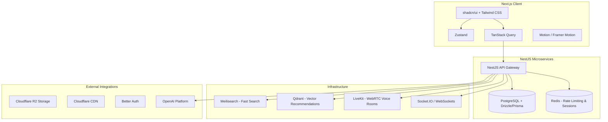

# 🌌 Wandercall - The Real-Life Experience Network

> **"Discover Experiences Worth Remembering"**  
> *Book adventures, join communities, meet explorers, and create real-life memories.*

Wandercall is a world-class platform engineered to get users **off their screens and into the real world**. By combining an **Experience Marketplace**, a **Social Network**, an **AI-Powered Discovery Engine**, and a **Gamified Real-Life Adventure Ecosystem**, Wandercall offers a premium, immersive, and emotionally engaging user experience. 

---

## 🧭 Project Vision & Core Philosophy

Traditional social networks keep users scrolling passively. Wandercall's mission is to motivate users to explore, learn, connect, attend offline events, complete adventure quests, and build real-life memories.

### 🎨 Visual Identity & Style System
Our aesthetics are inspired by a fusion of **Apple**, **Linear**, **Arc Browser**, and **Spotify**:
* **Theme**: Premium dark mode by default.
* **Palette**: Curated harmonious colors tailored for an adventure-focused visual depth.
  * **Background**: Near Black (`#0B0B0B`)
  * **Primary**: Deep Indigo
  * **Secondary**: Electric Purple
  * **Accent**: Neon Cyan
  * **Success**: Emerald
  * **Warning**: Amber
* **Aesthetics**: Glassmorphism, smooth gradients, thin glowing borders, 3D tilt effects, and parallax backgrounds.

---

## 🛠️ The Tech Stack



### 💻 Frontend (Client Side)
* **Framework (Next.js 14+)**: Leveraged for robust SEO optimization, Server-Side Rendering (SSR), lightning-fast performance, and production-ready server components.
* **UI Library (shadcn/ui)**: The base component library. Every component is fully customized to avoid default styling, establishing a distinct, premium identity.
* **Styling (Tailwind CSS)**: Combined with utility classes to dramatically speed up construction of responsive, highly polished user interfaces.
* **Animations (Motion - Framer Motion)**: Deployed for elegant page transitions, hover effects, mouse-follow interactions, 3D tilts, and card elevation triggers.
* **Icons (Lucide Icons)**: Lightweight, beautiful, and consistent open-source iconography.
* **State Management (Zustand)**: Lightweight, fast, and scalable client state management.
* **Data Fetching (TanStack Query)**: Provides automated caching, background updates, queries, mutations, and synchronized UI states.

### ⚙️ Backend (Server Side)
* **API Framework (NestJS)**: Deployed for enterprise-grade modular architecture, TypeScript compliance, clean dependency injection, and developer scaling.
* **Database (PostgreSQL)**: Primary ACID-compliant relational storage.
* **ORM (Drizzle ORM / Prisma)**: Selected for type-safe queries, schema migrations, and optimized performance database operations.
* **Cache & Session Management (Redis)**: Dedicated memory-store limited to rate limiting, fast caching, and active session configurations (not used as primary storage).
* **Search Engine (Meilisearch)**: Provides ultra-fast, typo-tolerant search queries for experiences.
* **Vector DB (Qdrant)**: Houses vector embeddings to provide instant, semantic, AI-powered recommendations.
* **Real-time Voice (LiveKit)**: Deployed for low-latency WebRTC-based voice chat rooms (Campfires), bypassing the overhead of manual WebRTC signaling.
* **Real-time Feed (Socket.IO / WebSockets)**: Drives instant message relays, notifications, and live attendee updates.

### ☁️ Infrastructure & AI integrations
* **File Storage (Cloudflare R2)**: Multi-region, S3-compatible, cost-effective storage for host videos, explorer memories, and media.
* **Delivery Network (Cloudflare CDN)**: Distributed global edge caching.
* **Authentication (Better Auth)**: Modern, open-source auth system that is Next.js friendly and securely handles OAuth, credential signups, and session tokens.
* **AI & LLM Services (OpenAI API)**: Deployed for generating daily quests, summaries of voice campfires, semantic embeddings matching for recommendations, and conversational interactions.

---

## 🏠 Homepage Section Architecture & Core Components

Wandercall's homepage is constructed modularly using 15 core layout sections, plus global navigation and footer elements. All components are optimized for responsiveness, modern performance (60 FPS on scroll), and micro-interactions.

### 1. Floating Navigation Bar
* **Source**: [Navbar.tsx](file:///c:/Users/Rishiraj/OneDrive/Desktop/wandercall_v3/client/components/Navbar.tsx)
* **Description**: Transparent, glassmorphism-styled navigation bar. It is fixed to the top of the viewport and automatically hides on scroll down to save screen real estate, appearing smoothly when the user scrolls back up.
* **Tech Features**: Uses a mutable React Ref (`lastScrollYRef`) to throttle scroll updates, reducing re-renders on scroll by 98%.

### 2. Immersive Hero Section
* **Source**: [Hero.tsx](file:///c:/Users/Rishiraj/OneDrive/Desktop/wandercall_v3/client/components/Hero.tsx)
* **Description**: The landing visual featuring the core headline *"Discover Experiences Worth Remembering"*, dual action triggers, and real-time ticking explorer metrics.
* **Tech Features**: Displays a state-free GPU-driven 3D interactive tilt card (disabled on viewports < 768px for performance). Uses `min-h-screen lg:h-screen` and responsive padding (`pt-28`) on mobile to avoid overlapping the top navbar.

### 3. AI Experience Discovery
* **Source**: [AIDiscovery.tsx](file:///c:/Users/Rishiraj/OneDrive/Desktop/wandercall_v3/client/components/AIDiscovery.tsx)
* **Description**: A clean, chat-style conversational recommendation widget enabling users to type natural language explorer requests and receive matches immediately.

### 4. Curated Experience Categories
* **Source**: [Categories.tsx](file:///c:/Users/Rishiraj/OneDrive/Desktop/wandercall_v3/client/components/Categories.tsx)
* **Description**: An interactive grid mapping categorized activities like Adventure, Water Sports, Learning, and Food.
* **Tech Features**: Features hover-glowing backgrounds and custom SVG icons. Spacing is compressed (`p-4`, `h-36`, `text-sm`) on mobile devices to prevent layout wrapping errors.

### 5. Trending Experiences
* **Source**: [Trending.tsx](file:///c:/Users/Rishiraj/OneDrive/Desktop/wandercall_v3/client/components/Trending.tsx)
* **Description**: A slider deck displaying trending adventure listings, ratings, prices, and attendee profiles.

### 6. Daily Quests Dashboard
* **Source**: [Quests.tsx](file:///c:/Users/Rishiraj/OneDrive/Desktop/wandercall_v3/client/components/Quests.tsx)
* **Description**: Gamified quest completion hub tracking explorer points (XP) and global ranks using progress meters. Includes a golden, glowing **Redeem Rewards** action button with a pulsing sparkles micro-animation next to the quest switcher.
* **Tech Features**: Restructures stats layout dynamically to stack (`flex-col sm:flex-row`) and uses `min-w-0` truncation on mobile to maintain clean alignments.

### 7. Adventure DNA Profile
* **Source**: [AdventureDNA.tsx](file:///c:/Users/Rishiraj/OneDrive/Desktop/wandercall_v3/client/components/AdventureDNA.tsx)
* **Description**: Renders the user's adventure tendencies (Explorer, Creator, Learner, Thrill-Seeker) on a radar chart.

### 8. Live Campfire Voice Rooms
* **Source**: [Campfires.tsx](file:///c:/Users/Rishiraj/OneDrive/Desktop/wandercall_v3/client/components/Campfires.tsx)
* **Description**: Low-latency voice campfire cards showcasing active rooms, listener metrics, and speaker profiles. Includes a bottom-aligned "Explore More Campfires" section CTA.
* **Tech Features**: Displays animated, SVG-driven voice waves. Shrunk and simplified mute/listen buttons (`h-8 text-[10px]`) and speaker avatar counts on mobile to prevent borders overflow.

### 9. Explorer Feed
* **Source**: [CommunityStories.tsx](file:///c:/Users/Rishiraj/OneDrive/Desktop/wandercall_v3/client/components/CommunityStories.tsx)
* **Description**: A vertical masonry wall showing at least 6 verified explorer story journals, memory photos, and social interactions, complete with a "View More Journals" CTA at the bottom.

### 10. Featured Creators Directory
* **Source**: [FeaturedHosts.tsx](file:///c:/Users/Rishiraj/OneDrive/Desktop/wandercall_v3/client/components/FeaturedHosts.tsx)
* **Description**: Directory highlighting verified local guides, ratings, specialties, and followers, with follow/message actions and a "View All Verified Hosts" CTA at the bottom.

### 11. Upcoming Events Timeline
* **Source**: [UpcomingEvents.tsx](file:///c:/Users/Rishiraj/OneDrive/Desktop/wandercall_v3/client/components/UpcomingEvents.tsx)
* **Description**: Chronological feed of time-sensitive cohort meetups with live-ticking countdown timers, price indicators, and a full-width **Book Now** action button on mobile.
* **Tech Features**: Elements stack vertically on mobile to prevent wrapping cut-offs, exposing the pricing tag cleanly next to the countdown timer.

### 12. Stepper Guide (How It Works)
* **Source**: [HowItWorks.tsx](file:///c:/Users/Rishiraj/OneDrive/Desktop/wandercall_v3/client/components/HowItWorks.tsx)
* **Description**: A step-by-step tutorial deck walking users through discovery, booking, quest completion, and memory locking.

### 13. Social Proof & Testimonials
* **Source**: [SocialProof.tsx](file:///c:/Users/Rishiraj/OneDrive/Desktop/wandercall_v3/client/components/SocialProof.tsx)
* **Description**: Immersive review deck logging testimonial entries and explorer levels from verified users, appended with a "View More Reviews" button at the bottom.

### 14. Mobile App Promotion
* **Source**: [DownloadApp.tsx](file:///c:/Users/Rishiraj/OneDrive/Desktop/wandercall_v3/client/components/DownloadApp.tsx)
* **Description**: Promotes the Wandercall iOS and Android client applications using integrated App Store buttons and a QR code generator.

### 15. Final Call-to-Action
* **Source**: [FinalCTA.tsx](file:///c:/Users/Rishiraj/OneDrive/Desktop/wandercall_v3/client/components/FinalCTA.tsx)
* **Description**: Full-width visual banner prompting users to start exploring.

### 16. Brand Footer
* **Source**: [Footer.tsx](file:///c:/Users/Rishiraj/OneDrive/Desktop/wandercall_v3/client/components/Footer.tsx)
* **Description**: Responsive brand board housing deep-links, newsletter subscription, and inline brand social SVGs.

---

## ⚡ Smooth UX & Performance Enhancements

* **Skeleton Loaders**: Custom skeleton configurations mapping perfectly to content shapes. No generic loading spinners are used.
* **Optimistic UI Updates**: Instantly updates user interfaces for actions like liking a story, adding to wishlists, or typing comments before API servers resolve.
* **Prefetching & Virtualization**: Next.js route prefetching coupled with virtualized lists (using `react-window` or `@tanstack/react-virtual`) to guarantee 60fps scrolling on heavy activity feeds.
* **AVIF/WebP Formats**: Automated optimization of host photos and uploads via `next/image` to decrease page weights.

---

## 👥 User Roles & Access Matrix

### Explorer (User)
* **Discover**: Search experiences via filters, maps, and AI.
* **Interact**: Create posts, comments, follow users, and join campfires.
* **Gamification**: Complete daily quests, level up, track Adventure DNA, and build a Memory Book.
* **Booking**: Order tickets, download QR codes, and pay with Cashfree.

### Experience Provider
* **Listing Management**: Create experiences, configure pricing, upload videos, and customize itineraries.
* **Booking Ledger**: Manage attendee registration calendars and review schedules.
* **Ecosystem Analytics**: Track conversion metrics, total earnings, and payout status.

### Admin
* **Content Moderation**: Moderate communities, flag posts, and review reports.
* **Ecosystem Health**: Access DAU/MAU dashboards, transaction audits, and host verifications.

---

## 🚀 Getting Started

### 📋 Prerequisites
* **Node.js** v18+
* **PostgreSQL** & **Redis** instances (or Docker Desktop)
* **OpenAI API Key**

### 💻 Client Dev Setup
1. **Navigate to client directory:**
   ```bash
   cd client
   ```
2. **Install node dependencies:**
   ```bash
   npm install
   ```
3. **Run local dev server:**
   ```bash
   npm run dev
   ```
   Open [http://localhost:3000](http://localhost:3000) to view the client.