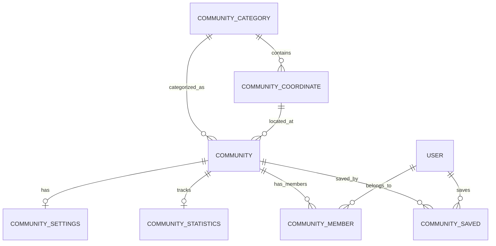
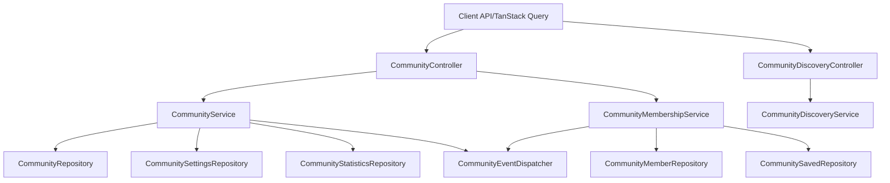

# Community Core Architecture

## Overview
The Community Core module establishes the foundational infrastructure for all community-based features in wandercall_v3. 

## Entity Relationship Diagram (ERD)

## Module Interaction Diagram

## Event Flow
The `CommunityEventDispatcher` decouples core logic from future modules (Notifications, Analytics, Feed).
- `COMMUNITY_CREATED`: Fired after a community, its settings, stats, and owner member row are committed in a transaction.
- `COMMUNITY_JOINED` / `COMMUNITY_LEFT`: Fired when users join or leave, allowing async recalculations.
- `COMMUNITY_SAVED` / `COMMUNITY_UNSAVED`: Fired when users save communities.
- `SETTINGS_UPDATED`: Fired when settings change, useful for audit logs.

## Frontend State Management Flow
- **TanStack Query (Server State)**: Manages all asynchronous data fetching, caching, and optimistic updates. Handled via `communityApi` and hooks in `client/hooks/useCommunity.ts`.
- **Redux Toolkit (UI State)**: Used exclusively for complex client-side synchronous state, such as the multi-step "Create Community Wizard" (managed in `communityWizardSlice.ts`).

## Galaxy Discovery Data Flow
1. Client requests clusters via `/discovery/communities/galaxy?categoryId=XYZ`
2. `CommunityDiscoveryController` passes request to `CommunityDiscoveryService`
3. The service fetches public, active communities, ordered by member count.
4. Communities are grouped by `coordinateId` in memory (or directly via SQL group by in a full production scenario) to form clusters.
5. Client renders 5 coordinates per cluster visually.

## Future Extension Points
- **Community Chat**: Listen to `COMMUNITY_CREATED` to automatically spin up a base Campfire/Group chat.
- **Stories/Feed**: Will reference the `CommunityEntity` ID. Discovery service will use indexes to surface these.
- **Moderation**: Will expand upon `CommunityMemberRole`.
- **Notifications**: Simply add listeners to `CommunityEventDispatcher`.
