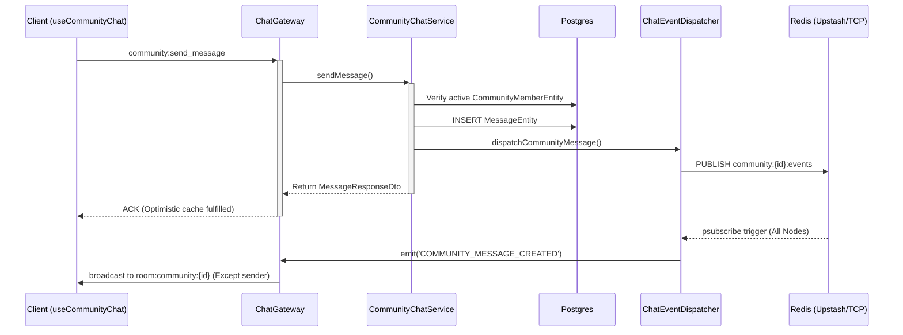

# Community Chat Domain Architecture

## Core Principles
The `CommunityChatService` operates entirely outside of standard `ConversationParticipantEntity` limitations, relying instead on `CommunityMemberEntity` to enforce RBAC (Role-Based Access Control) for 5,000+ member scales.

## Data Consistency Optimizations
Unlike DIRECT and GROUP chats, COMMUNITY chats completely bypass updating the `chat_conversations.unreadCounts` JSONB column. 
Doing so prevents intense database contention and row-level locks on the parent conversation record during high message-velocity events.
Watermarking (read receipts) is offloaded to Redis for communities.

## Cross-Node Realtime Fan-Out (Redis Pub/Sub)
The Socket Gateway scales horizontally across multiple nodes.
When a user sends a message to a community:
1. `ChatGateway` → `CommunityChatService.sendMessage`
2. Message is persisted atomically.
3. `CommunityChatService` calls `ChatEventDispatcher.dispatchCommunityMessage(communityId, message)`.
4. `ChatEventDispatcher` publishes to Redis Channel: `community:{communityId}:events`.
5. ALL instances of `ChatEventDispatcher` across ALL nodes are subscribed to `community:*:events` using `psubscribe`.
6. Every node receives the payload and locally broadcasts via Socket.IO: `server.to('room:community:' + communityId).emit('community:message:new')`.

## Socket Room Management
- Users join via the `join_community` event, adding their socket to `room:community:{communityId}`.
- This decoupling from their base `user:{userId}` room prevents massive arrays of user lookups.

## Sequence Diagram

