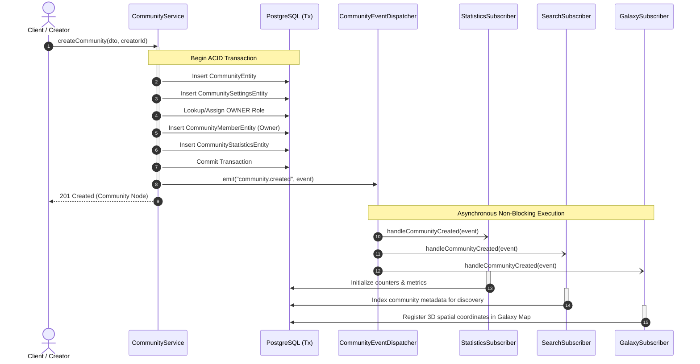
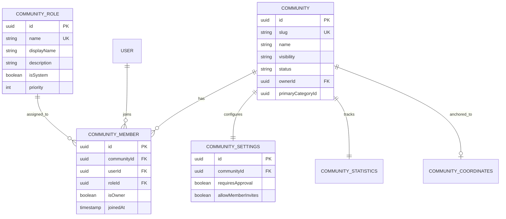
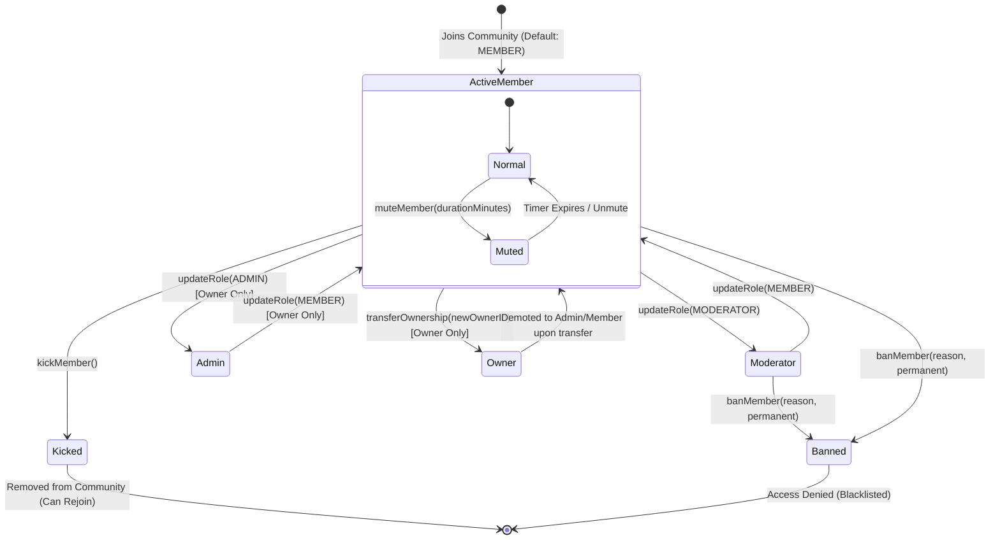

# Enterprise Community Architecture & RBAC System

This document outlines the technical architecture, data model, event-driven topology, and Role-Based Access Control (RBAC) system for the Wandercall Enterprise Community Service.

---

## 1. Executive Summary

Wandercall's Community Engine is designed as a multi-tenant, highly scalable domain capable of supporting thousands of concurrent travel communities, coordinates, and real-time member interactions. To ensure high availability, data consistency, and low-latency user interfaces, the architecture leverages:
- **Atomic Database Transactions**: Ensuring zero orphaned records or null foreign keys during community initialization and member onboarding.
- **Event-Driven Architecture (EDA)**: Decoupling core persistence from auxiliary services (search indexing, statistics aggregation, and 3D galaxy visualization) using a centralized event dispatcher.
- **Dynamic Frontend Registries & Caching**: Utilizing TanStack Query for optimistic UI state synchronization and an extensible message renderer registry for rich chat interactions.

---

## 2. Event-Driven Topology & Domain Subscribers

To prevent long-running synchronous operations during high-frequency domain actions (such as creating a community, joining, or leaving), the service implements an in-process domain event bus using `CommunityEventDispatcher`.

### 2.1 Event Flow Architecture



### 2.2 Subscriber Responsibilities
- **`CommunityStatisticsSubscriber`**: Listens to `community.created`, `community.member_joined`, and `community.member_left`. Automatically increments/decrements `currentMemberCount` and recalculates community energy scores without table-locking the main community record.
- **`CommunitySearchSubscriber`**: Maintains search indexes and keyword tags for full-text discovery when communities are updated or created.
- **`CommunityGalaxySubscriber`**: Synchronizes community spatial nodes with the interactive 3D Galaxy Map, updating cluster densities and coordinate linkages in real time.

---

## 3. Data Model & Atomic Coordination

A critical requirement of multi-tenant community platforms is ensuring that system roles and default configurations exist before user assignment.

### 3.1 Entity Relationship Diagram (ERD)



### 3.2 Solving the `roleId = NULL` Initialization Bottleneck
Historically, if system roles (`OWNER`, `ADMIN`, `MODERATOR`, `MEMBER`) were seeded asynchronously or lazily during request handling, race conditions caused creators to receive `roleId = NULL`.
To guarantee relational integrity:
1. **Bootstrap Seeding (`CommunityRoleSeederService`)**: Executed strictly during `onApplicationBootstrap()` after database schema synchronization (`dataSource.synchronize()`). It verifies and seeds immutable system roles with designated priority weights.
2. **Atomic Creation**: When a community is generated, `CommunityService.createCommunity()` queries the pre-seeded `OWNER` role within the same database transaction. If the role lookup fails or any child entity (`Settings`, `Statistics`) fails to persist, the entire transaction rolls back cleanly.

---

## 4. Role-Based Access Control (RBAC) & Moderation Lifecycle

Wandercall enforces a hierarchical RBAC permission model. Actions performed on community members are validated against role priority levels and explicit capability flags.

### 4.1 Permission Matrix

| Capability / Action | Owner | Admin | Moderator | Member |
| :--- | :---: | :---: | :---: | :---: |
| **Delete Community / Transfer Ownership** | ✅ | ❌ | ❌ | ❌ |
| **Promote / Demote Admins** | ✅ | ❌ | ❌ | ❌ |
| **Promote / Demote Moderators** | ✅ | ✅ | ❌ | ❌ |
| **Kick Member (`kickMember`)** | ✅ | ✅ | ✅ | ❌ |
| **Ban Member (`banMember`)** | ✅ | ✅ | ✅ | ❌ |
| **Mute Member (`muteMember`)** | ✅ | ✅ | ✅ | ❌ |
| **Invite New Members** | ✅ | ✅ | ✅ | ⚠️ *(If enabled)* |
| **Participate in Chat / Book Experiences** | ✅ | ✅ | ✅ | ✅ |

### 4.2 Member Moderation Lifecycle



---

## 5. Frontend Operational Center & Chat Integration

The frontend client leverages modular design patterns and React best practices to deliver a stunning, responsive operational center for community leaders.

### 5.1 TanStack Query Synchronization Strategy
All moderation actions (`useKickMember`, `useBanMember`, `useMuteMember`, `useUpdateRole`, `useTransferOwnership`) trigger surgical cache invalidations upon success:
```typescript
onSuccess: () => {
  // 1. Invalidate specific member list query to refresh UI instantly
  queryClient.invalidateQueries({ queryKey: ['communities', 'members', communityId] });
  // 2. Invalidate community detail metadata (member counts, online status)
  queryClient.invalidateQueries({ queryKey: ['communities', 'detail'] });
  // 3. Invalidate personal membership state if ownership changed
  queryClient.invalidateQueries({ queryKey: ['community', 'me'] });
}
```

### 5.2 Extensible Chat Renderer Registry (`MESSAGE_RENDERER_REGISTRY`)
To prevent monolithic conditional clutter (`if (msg.type === '...')`) within chat loops, the client utilizes a central message renderer registry:
- **`registry.ts`**: Maps message types (e.g., `COMMUNITY_INVITE`, `TEXT`, `AUDIO`) to specialized React components.
- **`CommunityInviteRenderer.tsx`**: Renders interactive invitation cards embedded directly inside chat threads, featuring rich cover images, member counts, and optimistic **Join / Decline** action buttons.
- **Decoupled Execution**: Chat views (`[chatId]/page.tsx` and `friends/page.tsx`) simply invoke `getMessageRenderer(msg.type)` and render the component dynamically.

---

## 6. Verification & System Health

1. **TypeScript Compile Safety**: Both `backend` and `client` codebases maintain strict type safety, verified via automated `npx tsc --noEmit` checks.
2. **Knowledge Graph Synchronization**: This architecture document is continuously synchronized with the workspace Graphify knowledge graph (`graphify-out/`), enabling semantic queries, relationship tracing, and impact analysis across the entire full-stack ecosystem.

---

## 7. Modular Domain Services & Real-Time WebSocket Telemetry (Phase 7.5)

To eliminate God-class anti-patterns inside `CommunityService`, all specialized capabilities are segregated into domain-specific services inside `backend/src/modules/community/services/`:

### 7.1 Specialized Service Architecture
```mermaid
graph TD
    CS[CommunityService (Monolith Facade / Core CRUD)] --> CRS[CommunityRoleService]
    CS --> CMS[CommunityModerationService]
    CS --> CAS[CommunityAuditService]
    CS --> CSS[CommunityStoryService]
    CS --> CST[CommunityStatsService]
    
    CMS --> CAS
    CRS --> CAS
    CSS --> CAS
    
    CMS --> Bus[CommunityEventDispatcher]
    CRS --> Bus
    
    Bus --> GW[ChatGateway WebSocket Lobbies]
```

1. **`CommunityRoleService`**:
   - Manages custom community roles, display badges (`displayColor`, `displayName`), and granular capability arrays (`post.create`, `chat.send`, `member.mute`, `member.kick`, `member.ban`, `role.assign`, `role.manage`, `admin.access`).
   - Enforces hierarchy invariants: An actor can only assign or modify roles whose `priority` rank number is strictly greater than their own rank (`actor.priority < target.priority`).
2. **`CommunityModerationService`**:
   - Implements `muteMember(communityId, targetUserId, durationMinutes, reason, actorId)`, setting `isMuted` and computing `mutedUntil`.
   - Implements `banMember` and `kickMember`, immediately revoking room memberships and emitting real-time WebSocket events.
3. **`CommunityAuditService` & `CommunityAuditLogEntity`**:
   - Persists an immutable ledger of administrative actions (`ROLE_CREATED`, `MUTE`, `BAN`, `STORY_PINNED`, etc.), capturing `actorId`, `targetId`, `reason`, and `metadata`.
4. **`CommunityEventDispatcher` & WebSocket Telemetry**:
   - When a moderation action occurs, `CommunityEventDispatcher` broadcasts `community:moderation:action` and `community:role:updated` directly to `room:community:${communityId}` via `ChatGateway`.
   - Connected clients instantly reflect muted states, rank updates, or removals without requiring manual page refreshes.

---

## 8. Enterprise Admin Command OS (Phase 7.6)

The frontend features a luxury, OS-grade moderation center accessible to Level 1 Owners and verified Administrators:

1. **`CommunityAdminDashboard` (`components/community/admin/CommunityAdminDashboard.tsx`)**:
   - **Overview KPIs**: Live telemetry for total members, 24h active pulse, story broadcasts, and chat throughput.
   - **Members Directory**: Searchable index of all community coordinates with one-click access to moderation tools.
   - **Role Matrix Editor (`RoleMatrixEditor.tsx`)**: Interactive UI for creating custom ranks, setting display colors, and toggling capability checkboxes.
   - **Policies & Gatekeeping**: Configure `joinPolicy` (`OPEN`, `INVITE_ONLY`, `APPROVAL_REQUIRED`) and galaxy discoverability.
   - **Audit Ledger (`AuditLogsTable.tsx`)**: Real-time tabular history of all administrative actions with text and type filtering.
2. **`MemberDetailsControlCenter` (`components/community/moderation/MemberDetailsControlCenter.tsx`)**:
   - An interactive command modal providing instant trust score metrics, role upgrades/demotions, timed mutes (`15m`, `1h`, `24h`), kicks, and permanent bans with mandatory audit logs.
