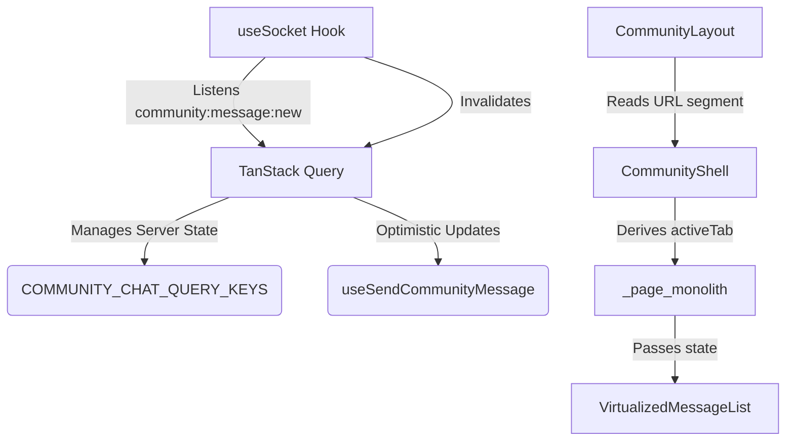
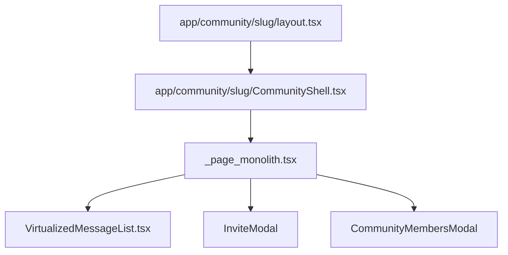

# Community Chat Architecture

## State Ownership Diagram

## Component Graph

## Refactoring Note
The monolith `page.tsx` was wrapped in a Next.js Layout (`layout.tsx`). The `CommunityShell` component intercepts the URL segments to set the `activeTab` inside the monolith, maintaining 100% UI parity while enabling App Router nested routes. The Chat Feed uses `react-virtuoso` for rendering performance.
