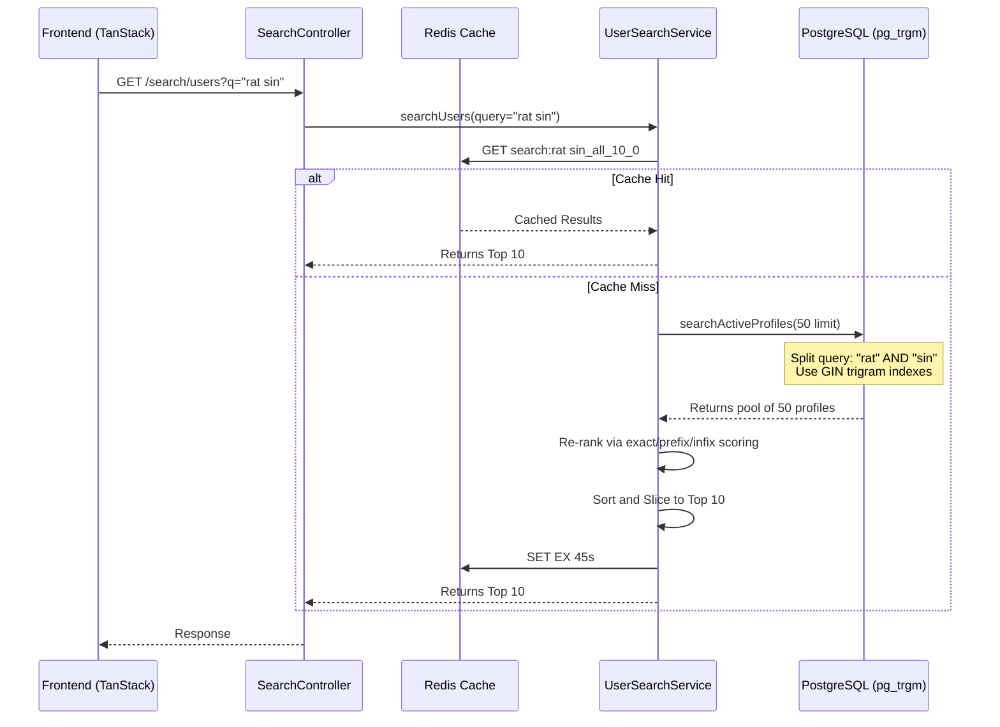

# Wandercall Enterprise Search Architecture

## Overview
The Wandercall User Search System is a hybrid search engine designed to handle millions of users efficiently while delivering highly relevant, ranked results. The architecture guarantees a maximum response size of 10 users per search query to maintain high performance and low bandwidth usage.

## Component Flow

1. **Frontend Request**
   - The user inputs a query in `FriendsSearchPage` (`/profile/friends/search`).
   - `useUserSearch` TanStack Query hook debounces and triggers a request to `/search/users`.
   - UI State (such as active filters) is maintained locally or in Redux, while search results (Server State) are maintained by TanStack Query.

2. **Backend Controller**
   - `SearchController.searchUsers` receives the request and extracts the query, limit (hardcoded to 10), and cursor.

3. **Caching Layer (Redis)**
   - `UserSearchService` attempts to fetch a short-lived cache (45 seconds) from Redis via `RedisService` using a normalized cache key: `search:{query}_{filter}_10_{offset}`.
   - If a cache hit occurs, the cached JSON result is returned immediately, completely bypassing the database.

4. **Database Querying (TypeORM + pg_trgm)**
   - If no cache exists, the query is passed to `UserRepository.searchActiveProfiles`.
   - The query is tokenized by whitespace into individual words (e.g. `rat sin` -> `["rat", "sin"]`).
   - PostgreSQL uses the `pg_trgm` extension. `GIN` indexes on `username` and `displayName` allow ultra-fast execution of `ILIKE '%term%'`.
   - Each term corresponds to a mandatory `AND` condition ensuring we strictly match the desired tokens across the profile fields.
   - The Database layer fetches a pool of up to 50 relevant profiles.

5. **In-Memory JavaScript Re-ranking**
   - The service processes the 50 fetched profiles and assigns a relevancy score based on deterministic rules:
     - Exact Username Match: `+10000`
     - Exact DisplayName Match: `+9000`
     - Prefix Match: `+5000`
     - Word/Token Prefix Match: `+3000`
     - Substring/Infix Match: `+1000`
   - Initial `reputationScore` acts as the baseline tie-breaker.
   - The result pool is sorted by the final score in descending order.

6. **Pagination and Cache Update**
   - The sorted pool is sliced down to the mandated limit of 10 items.
   - The final result is cached into Redis for 45 seconds using `PX` expiry.
   - The response is delivered to the client.

## Diagram

